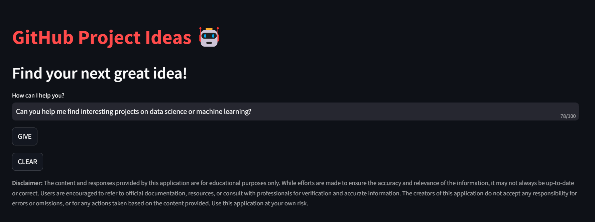
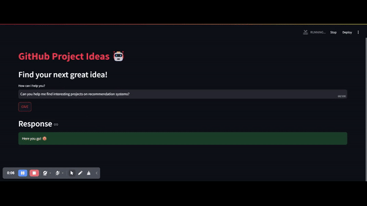
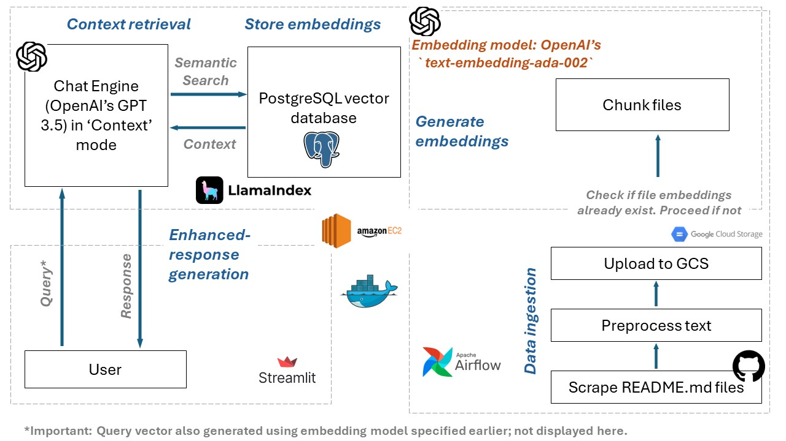
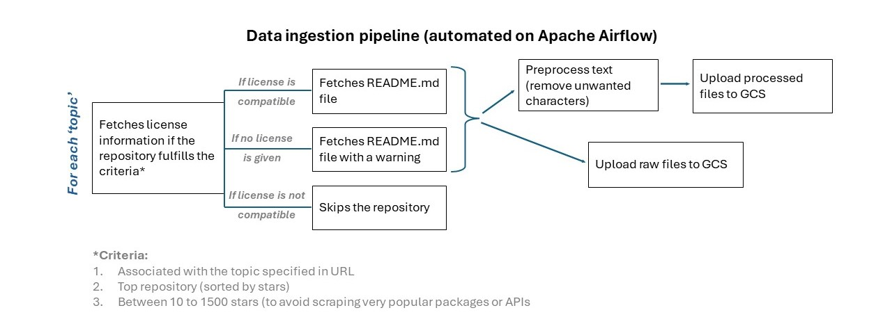
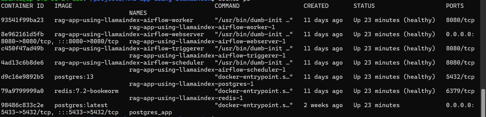
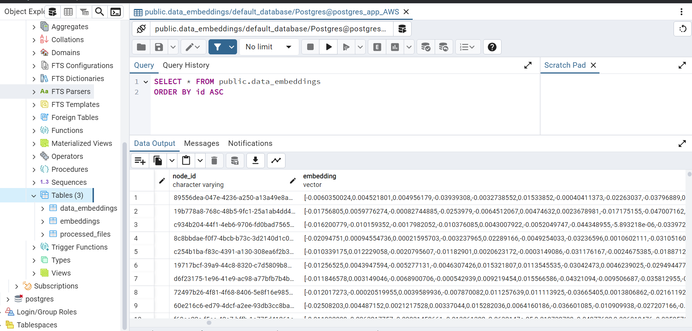
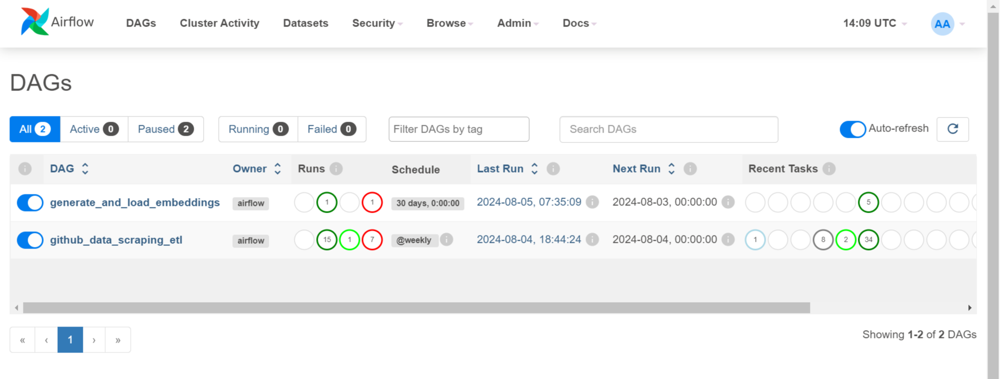
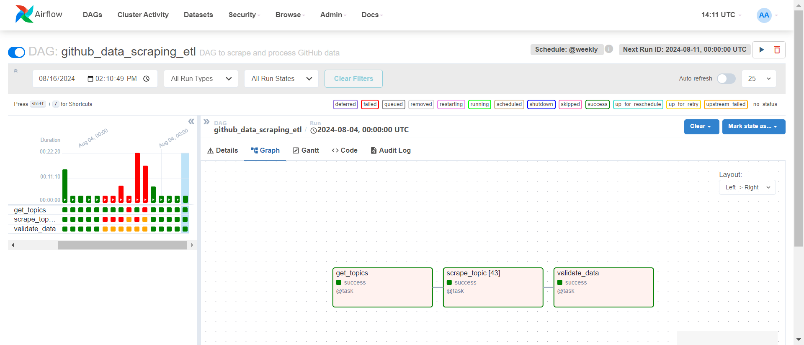
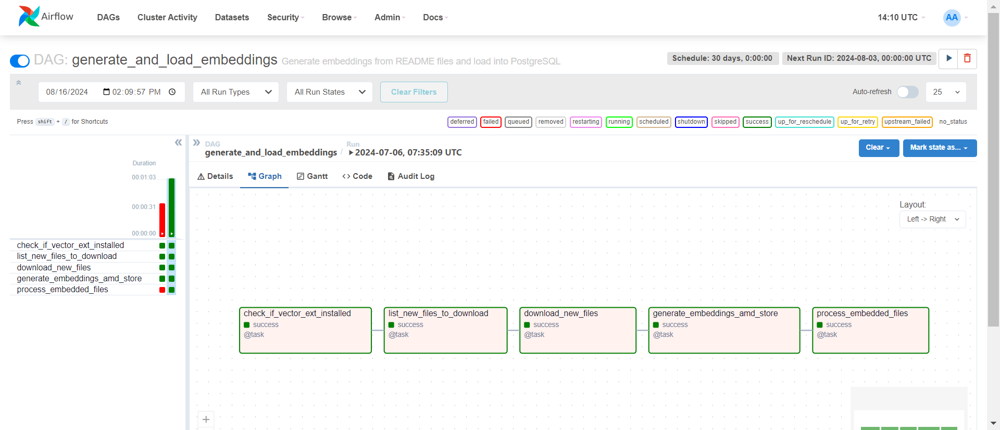

# GitHub Ideation Bot: An End-to-End LLMOps Pipeline with LlamaIndex, Airflow and Docker

### Author: [Shefali Shrivastava](https://www.github.com/shefalishr95)

## Project Overview

This project features a **semi-automated LLMOps pipeline** designed to scrape README.md files from popular GitHub repositories in the fields of data science and machine learning to identify innovative project ideas and technical insights. The data pipeline, orchestrated entirely on **Airflow**, ingests README.md files and generates embeddings using **LlamaIndex and OpenAI's** legacy embedding model. It then deploys a **chatbot with retrieval-augmented generation (RAG)** capabilities powered by OpenAI's `GPT-3.5` to interact with the embeddings, providing users with relevant responses to queries. The entire pipeline is containerized using **Docker** and hosted on an **AWS EC2** instance (`t2.xlarge`) with **PostgreSQL** as primary database and **Google Cloud Storage** as intermediate database.



_Notice: All information provided is intended solely for educational purposes. When generating ideas using the bot, it is your responsibility to conduct thorough research and ensure the inclusion of accurate citations where applicable. Do not imitate any repository unless it is legally permissible under the license provided. The author takes no responsibility for any conflicts arising therefrom._

## Purpose

This project is designed to empower students and amateur data enthusiasts by providing a platform to discover creative project ideas and gain technical insights in data science and machine learning. Common LLMs, trained on generic data, often suggest basic projects like house price prediction or movie recommendation systems, which are generally insufficient for demonstrating technical skills by industry standards. This platform, through its chatbot ("GitHub Project Ideas") with retrieval-augmented generation (RAG) capabilities, helps users find more advanced and relevant projects by searching specific topics within README.md files from top GitHub repositories.



Beyond its educational value, this project also offers business potential. With the growing interest in data science, there's an increasing demand for resources that go beyond the basics. This project targets this need by offering a unique resource that isn't commonly available, catering to a large and eager audience in the field.

## Tech stack

<div style="display: flex; align-items: center;">


</div>

## Key features

- **Automated Data Collection**: Scraped README.md files from popular GitHub repositories on a weekly basis.
- **Data Processing and Embeddings**: Utilized LlamaIndex framework and OpenAI models for embeddings generation, and PostgreSQL vector database for storage.
- **Interactive Chatbot**: Deployed a RAG chatbot using GPT-3.5 on Streamlit.\*
- **Containerized Deployment**: Used Docker for seamless deployment and scalability.
- **Cloud Hosting**: Hosted on AWS EC2 `t2.xlarge`.

\*The web app is currently unavailable due to resource constraints.

## Architecture


_Figure 1: Overall architecture of the model_


_Figure 2: Data ingestion pipeline_

## Directory Structure

```
RAG-app-using-LlamaIndex
├─ config
│  └─ config.json
├─ dags
│  ├─ etl_dag.py
│  └─ generate_embeddings.py
├─ logs
│  └─ scheduler
│     └─ latest
├─ plugins
├─ src
│  └─ assets
│     ├─ diagrams
│     │  ├─ data_ingestion.JPG
│     │  └─ overall_architecture.JPG
│     ├─ screenshots
│     │  ├─ DAGs-Airflow.png
│     │  ├─ docker-containers.png
│     │  ├─ generate_and_load_embeddings-Grid-Airflow.png
│     │  ├─ github_data_scraping_etl-Grid-Airflow.png
│     │  ├─ overview.png
│     │  ├─ pgadmin-1.png
│     │  └─ pgadmin-2.png
│     └─ videos
│        ├─ GitHub Project Ideas-anamoly detection-papers only.webm
│        ├─ GitHub Project Ideas-CV.mp4
│        ├─ GitHub Project Ideas-time series forecasting.webm
│        ├─ GitHub Project Ideas-time series.mp4
│        ├─ GitHub Project Ideas-zero shot learning.webm
│        └─ main-page.gif
├─ streamlit
│  ├─ app.py
│  └─ requirements.txt
├─ utils
│  ├─ __pycache__
│  │  ├─ embed.cpython-311.pyc
│  │  ├─ extract.cpython-311.pyc
│  │  ├─ process.cpython-311.pyc
│  │  └─ __init__.cpython-311.pyc
│  ├─ embed.py
│  ├─ extract.py
│  ├─ process.py
│  └─ __init__.py
├─ docker-compose.yaml
├─ Dockerfile
├─ LICENSE
├─ README.md
└─ requirements.txt
```

## Installation and Usage

### Prerequisites

To run this repository, you will need the following set-up:

1. **Docker** (local or on cloud)
2. **Google Cloud Storage** (with read and write access, and the ability to set up external connections)
3. **GitHub PAT**
4. **OpenAI API token**
5. **PostgreSQL database** (with read and write access)

### Steps

1. **Clone the repository**:

   ```bash
   git clone https://github.com/shefalishr95/RAG-app-using-LlamaIndex.git
   ```

2. **Create a `.env` file** in the root directory with the following content:

   ```bash
   AAIRFLOW_UID=50000
   AIRFLOW_GID=0
   OPENAI_API_KEY='your_api_key'
   GITHUB_API_KEY='your_api_key'
   ```

3. **Build the Airflow and PostgreSQL containers**:
   Follow the instructions to build and run the containers for Airflow and PostgreSQL.

   
   _Figure 3: Sample Docker containers set-up_

4. **Set up external connections**:
   Configure Google Cloud Storage and PostgreSQL connections in Airflow. This can be done using the UI or in-line code. If you choose the latter, you will need to add the code manually.

5. **Download pgvector**:
   Ensure that pgvector is installed in your PostgreSQL container. This extension is necessary for storing vectors and conducting vector similarity search.

   
   _Figure 4: 'data-embeddings' table with vectors (dim: 1536)_

6. **Open the Airflow UI**:
   Access the Airflow UI at `http://your-host:8080`.

   
   _Figure 5: Airflow UI with DAGs set up_

7. **Trigger the DAG**:
   Trigger both DAGs, making sure to adjust the start date and frequency according to your requirements.

   
   _Figure 6: Airflow DAG: github-data-scraping-etl_

   
   _Figure 7: Airflow DAG: generate-and-load-embeddings_

**Note**: If you use Docker Swarm or any other tool to secure secrets such as API keys and connections, you do not need to create `.env` files separately for API keys.

## License

MIT License
